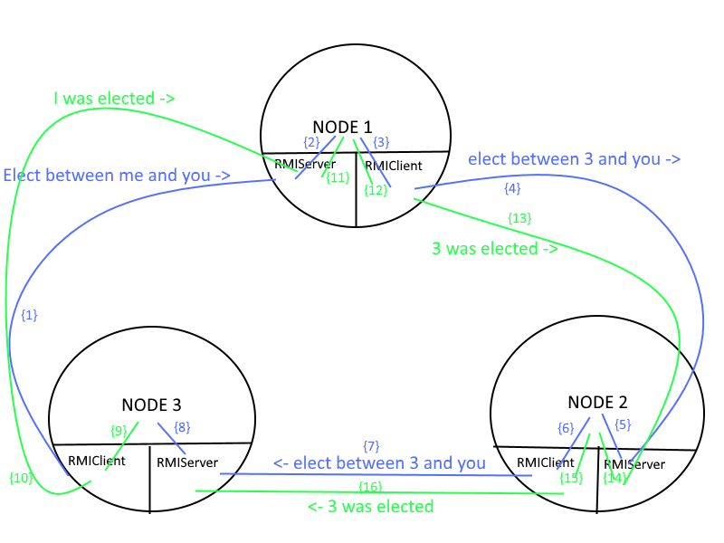

# Distributed Architecture
## Ring Network Election algorithm in a RMI application context
### Henrik Akesson & Fabien Salathe

This project's purpose is to implement a Ring election between three Nodes.

Each Node is composed of an RMI Server and an RMI Client.

The RMI Client is linked to the next Node's RMI Server.

Command line arguments:
  - Number of election processes to run for each node

The program works the following way:

A Node launches an RMIServer and an RMIClient
Regularly (between 0 and 2 seconds), the client starts an Election process
  - The number of election processes is given to the Node at instantiation time
  - The Client signals to the next Node's RMI Server that it should elect between itself and this Node
  - The next Node's Server then calls its elect method, which in turn will send it's result (through a new thread) to it's client who calls the next node's server's elect method
  - When a Node sees that the elected Node is itself, it stops the election process and starts the result announcement (through a new Thread)
  - Each node forwards the result until the elected node receives its result again, who then sets its announcement flag as false

When a Node sends its RMIClient a message (either for announcing results or elections), a separate Thread is used for that purpose specifically. This allows caller Nodes to be able to function freely after an election is started.

# Example of an election process started by Node 3

- Node 3's RMIClient signals Node 1's RMIServer that it should elect between itself and Node 3
- Node 1's RMIServer calls its parent Node's elect method, which elects Node 3 because of its higher id value and equal aptitude (0)
- Node 1 signals its RMIClient to pass the message along
- Once Node 3's RMIServer's elect method is called by Node 2, Node 3 sees that the elected Node is itself, and signal its RMIClient to start the result announcement process, is sent across the chain
- Node 3 receives a result message from Node 2, the election process is stopped.